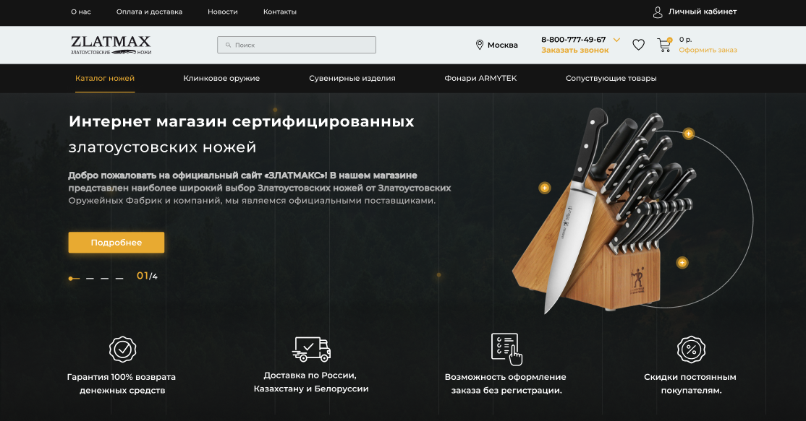

# Zlatmax Clone
<h4>👨‍💻Team Project📂</h4>
<h4>Deadline 29-March 2024 ⏰04:00 PM ✅</h4>

---

<h2>Hello, I will briefly tell you about this website, this site is Zlatmax, on this site you can buy all kinds of knives that you need.</h2>
<h2>Original site <a href="https://www.zlatmax.ru/">view </a></h2>
<h2>For Figma <a href="https://www.figma.com/file/S71G1ABNrnyajCLSm8b1se/zlatmax---catalog-(Community)?type=design&node-id=39-33&mode=design&t=Eg4D0I2ynYUW9CeW-0" target="_blank">Watch </a></h2>

---
<h2>Technologies used --->
   HTML,
   CSS,
   PUG,
   SCSS.
</h2>

---

# The team of developers

| Devs Name | Work | Section № |
|:-:|:-:|:-:|
| Nodir | Navbar | 1
| Jasur | Header | 2
| Jasmina | Cards | 3
| Asliddin | | 4
| Asilbek Shax | | 5
| Samira | | 6
| Mirhamid | | 7
| ~Nodir~ | ___Nothing___ | 8
| Asilbek | Cards | 9
| Hasan | Footer | 10

